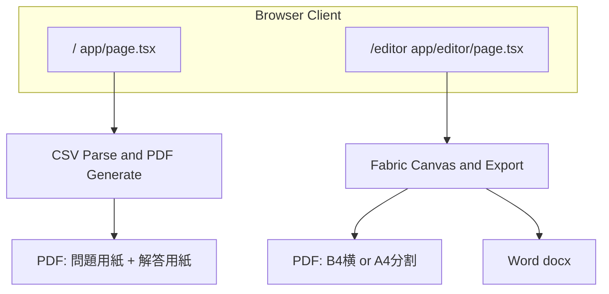
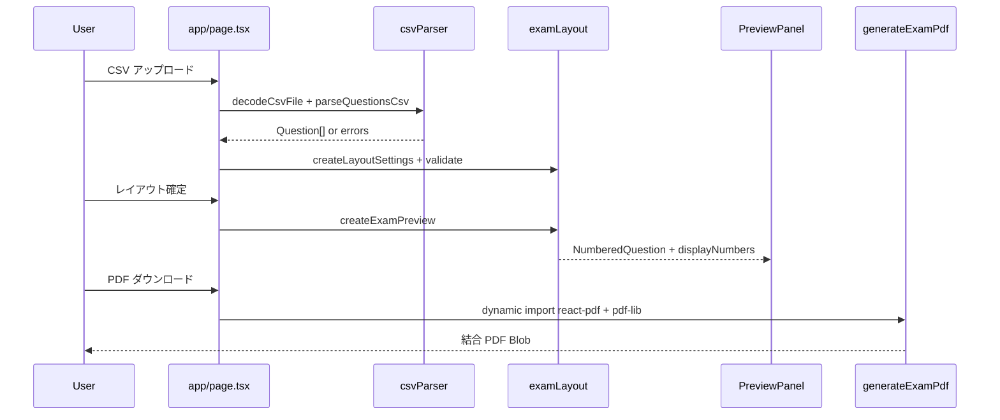
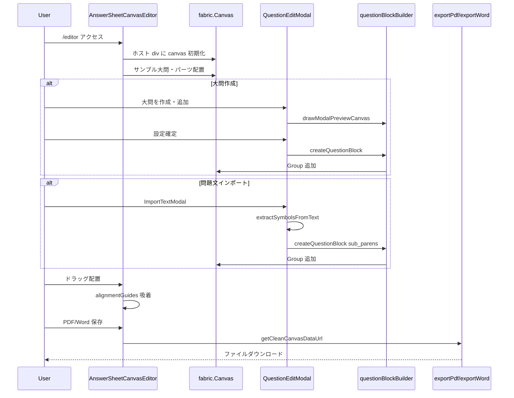
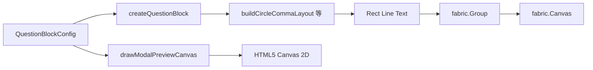
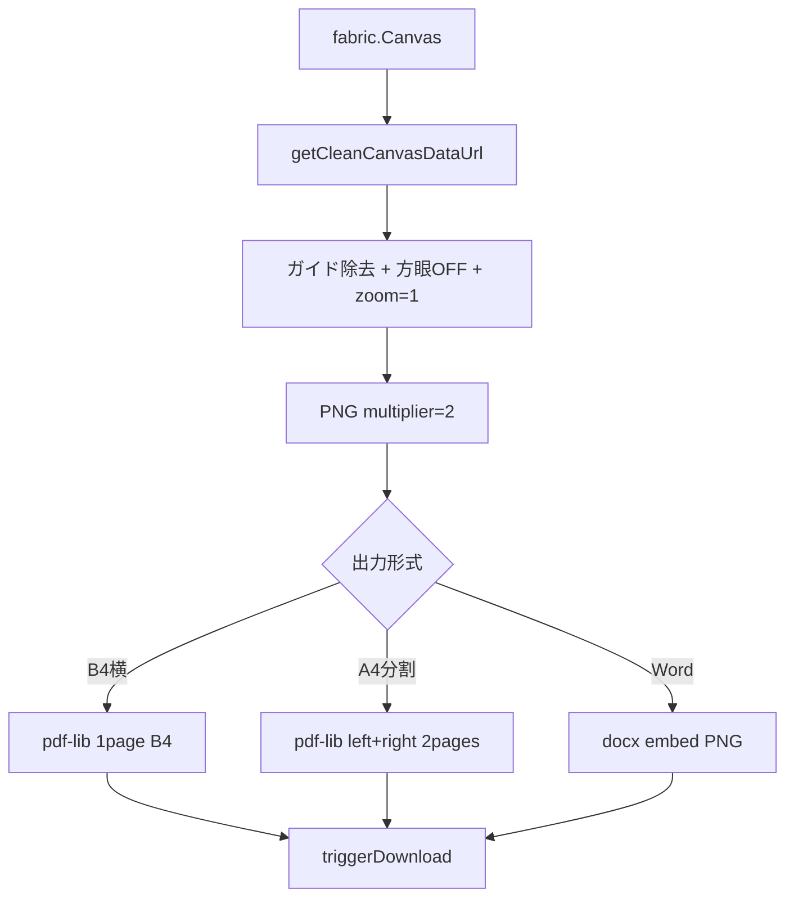

# 解答用紙作成アプリ 業務フロー

関連ドキュメント:

- [利用ガイド](./USER_GUIDE.md) — 操作手順（利用者向け）
- [技術仕様書](./TECHNICAL_SPEC.md) — モジュール・型定義の詳細

**読者**: 開発・運用担当者（機能間関係・データの流れ）

---

## 1. システム全体像

本リポジトリは **2つの独立アプリケーション** を1つの Next.js プロジェクトに同居させている。



**現状の制約**: 両機能間にデータ連携はない。CSV で生成した問題データをエディタへ渡す機能は未実装。

---

## 2. 機能マップ

| 機能 | ルート | 入口 UI | 入力 | 出力 |
|------|--------|---------|------|------|
| CSV ジェネレータ | `/` | CsvUploader | CSV ファイル | 問題+解答 PDF（@react-pdf） |
| キャンバスエディタ | `/editor` | トップリンク | 手動配置・テキスト貼付 | B4 PDF / A4分割 PDF / docx |

---

## 3. フローA: CSV ジェネレータ



**状態の要点**:

- `questions` — CSV から得た生データ
- `appliedSettings` — 確定済みレイアウト
- `displayNumber` — 問題用紙・解答用紙・PDF で共有する通し番号

---

## 4. フローB: キャンバスエディタ



**状態の要点**:

- Fabric canvas 上のオブジェクトが唯一のソースオブジェクト
- 大問のみ `questionConfig`（JSON）を Group に保持
- 永続化レイヤーなし（リロードで消失）

---

## 5. 大問ブロック生成フロー



| pattern | レイアウト関数 | 描画内容 |
|---------|---------------|----------|
| `sub_parens` | 行×列ループ | セル枠 + ラベル枠 |
| `grid` | 行×列ループ | セル枠のみ |
| `circle_comma` | `buildCircleCommaLayout` | 外枠1 + 縦横内部線 + 丸数字/カンマ |
| `split_2` | 比率計算 | 左右2 Rect |

---

## 6. プレビュー同期フロー

モーダルと canvas で **同一の layout 関数** を共有する設計。

```
QuestionBlockConfig
    ├─→ drawModalPreviewCanvas (width=580)  … モーダル内プレビュー
    └─→ createQuestionBlock (width=630)     … Fabric canvas 上の Group
```

**開発時ルール**（`.cursor/rules/answer-paper-editor-workflow.mdc`）:

- 描画変更は両関数を必ずペア更新
- 型変更は `types/editor.ts` + モーダル + デフォルト config まで一式

---

## 7. エクスポートフロー



A4分割: B4横 canvas（1376px）の左半（688px）→ A4 p1、右半 → A4 p2。

---

## 8. 機能選択ガイド（開発視点）

| 変更内容 | 触る機能 | 主なファイル |
|----------|----------|-------------|
| CSV 形式・問題タイプ追加 | Part A | `types/question.ts`, `csvParser.ts`, `pdfDocuments.tsx` |
| 4択/単語/記述の解答欄レイアウト | Part A | `AnswerSheetPreview.tsx`, `pdfDocuments.tsx` |
| 定期考査解答用紙の枠・パターン | Part B | `questionBlockBuilder.ts`, `QuestionEditModal.tsx` |
| ドラッグ UX・吸着 | Part B | `alignmentGuides.ts`, `AnswerSheetCanvasEditor.tsx` |
| 出力形式追加 | Part B | `exportPdf.ts`, `exportWord.ts` |
| 両機能のデータ連携 | 新規設計 | 未実装 — 接点設計が必要 |

---

## 9. 将来拡張の接点（未実装）

以下は現コードベースに存在しない。設計検討用のメモ。

| 拡張 | 概要 | 想定接点 |
|------|------|----------|
| CSV → エディタ連携 | CSV 問題データから大問ブロック自動配置 | `Question[]` → `QuestionBlockConfig[]` 変換層 |
| レイアウト保存/読込 | JSON シリアライズ of canvas objects | `canvas.toJSON()` / `loadFromJSON()` |
| サーバー保存 | 教員アカウントごとのテンプレート管理 | API + DB（現状サーバーなし） |
| Part A/B 統合 PDF | 問題用紙（A）+ 手作り解答用紙（B）を1 PDF | pdf-lib 結合パイプライン |

---

## 10. 変更時チェックリスト

### Part A を変更した場合

- [ ] CSV サンプルでパースが通る
- [ ] 問題用紙・解答用紙の displayNumber 一致
- [ ] PDF 結合ダウンロード成功

### Part B を変更した場合

- [ ] `createQuestionBlock` と `drawModalPreviewCanvas` を両方更新
- [ ] `QuestionEditModal` の state / getCurrentConfig 更新
- [ ] デフォルト config（`AnswerSheetCanvasEditor`, `ImportTextModal`）更新
- [ ] モーダルプレビューと canvas の見た目一致
- [ ] B4 PDF / A4分割 PDF / Word 出力成功
- [ ] `npm run build` 成功
